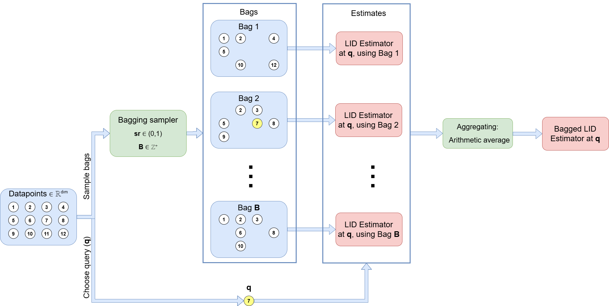

<p align="center">
  
</p>


# Bagging for LID estimation

This repository has been developed for the publication: [On the Use of Bagging for Local Intrinsic Dimensionality Estimation](https://linktopaper)

## Installation

Clone the main repository to a selected folder

```bash
git clone https://github.com/pekristof/Bagging_for_LID.git
```

Navigate to selected folder

```bash
cd Bagging_for_LID
```

Install requirements. Python version $\geq 3.11$ required.

```bash
pip install -r requirements.txt
```

Install package

```bash
pip install -e .
```
## Reproducibility

#### Recreating results and figures from the publication [On the Use of Bagging for Local Intrinsic Dimensionality Estimation](https://linktopaper) 

- The [recreate_results_notebook](Reproducibility/recreate_results_notebook.ipynb) jupyter notebook file contains detailed, step-by-step instructions on how to
recreate the results and figures present in the paper from scratch, or by loading already computed experiment objects.
- The [recreate_example_figures](Reproducibility/recreate_example_figures.ipynb) jupyter notebook file can be used to recreate the plots in the Introduction section of the publication.
- The [recreate_results](Reproducibility/recreate_results.py) python file can be used to recreate the same results without the use of jupyter notebook.

## Data availability

#### Downloading the exact experiment objects containing the data and already performed experiments for the publication [On the Use of Bagging for Local Intrinsic Dimensionality Estimation](https://linktopaper)

- Zenodo link placeholder: The source files (.pkl) available at https://zenodo.org/ can be used together with our code to extract all the necessary information about the performed experiments, as well as to recreate the figures and the values in the tables. The files should be loaded and used by either [recreate_results_notebook](recreate_results_notebook.ipynb) or [recreate_results](recreate_results.py) and setting load = True.

- Don't forget to make this GitHub repo public once it is ready for submission.

- Don't forget to fix this README to the paths of the eventual public github page, paper, and so on.

## Tutorial for the package

#### Using the Bagging_for_LID package to run your own LID estimation experiments

- The [single_experiment](Tutorials/single_experiment.ipynb) jupyter notebook file can be used to learn how to use the repository for examining or performing single LID estimation experiments, or multiple ones at once for a range of parameter combinations.


